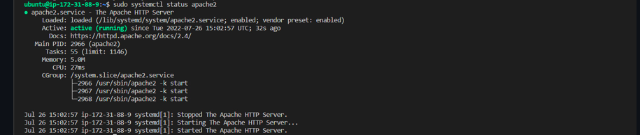

Load-Balancing-with-Apache

I introduced the concept of file sharing on multiple web servers to access same shared content on an independent external NFS server.
Balancing the workload on single webserver with other servers is done here.

We implement a Load Balancing solution using apache2 so as to handle routing users request to our web servers.

application_architecture

Implementation

Create an ubuntu server which will server as loadbalancer to the webservers create_lb

It is important to open up TCP port 80 in the load balancers inbound rule as requests are made through it.

inbound_rules

Installing Packages

Install apache2, libxml and then configure apache for loadbalancing via enabling proxy and proxy_balancer

# Installing apache2
sudo apt update
sudo apt install apache2 -y
sudo apt-get install libxml2-dev
#Enable following modules:
sudo a2enmod rewrite
sudo a2enmod proxy
sudo a2enmod proxy_balancer
sudo a2enmod proxy_http
sudo a2enmod headers
sudo a2enmod lbmethod_bytraffic
#Restart apache2 service
sudo systemctl restart apache2
sudo systemctl status apache2

apache_running

Configuring Load Balancer

Edit the default.conf file to add the backend web servers into the loadbalancers proxy for routing.

sudo vi /etc/apache2/sites-available/000-default.conf

#Add this configuration into this section <VirtualHost *:80>  </VirtualHost>

<Proxy "balancer://mycluster">
               BalancerMember http://<WebServer1-Private-IP-Address>:80 loadfactor=5 timeout=1
               BalancerMember http://<WebServer2-Private-IP-Address>:80 loadfactor=5 timeout=1
               ProxySet lbmethod=bytraffic
               # ProxySet lbmethod=byrequests
        </Proxy>

        ProxyPreserveHost On
        ProxyPass / balancer://mycluster/
        ProxyPassReverse / balancer://mycluster/
Note: Only 2 servers were added to the proxy list and also other ways to route traffic aside bytraffic includes byrequests, bybusyness, heartbeats which can be specified in ProxySet lbmethod=? .

configure_lb

Restart the apache2 server sudo systemctl restart apache2

On the web browser, test the load balancing connection using the public Ip address of our load balancer server. lb_log_browser

To confirm that traffic is routed evenly to both web servers as the load balancer server is receiving traffic (which in our case is by refreshing the webpage) we can check the logs both servers receive sudo tail -f /var/log/httpd/access_log

Server1 

server2

